[TOC]

**Solution Overview**
===============
Based on Cloud Search Service (CSS), Relational Database Service (RDS), and Data Replication Service (DRS), this solution allows you to easily build SQL acceleration solutions with low costs. You can synchronize data in real time without coding, easily coping with search traffic peaks and improving multi-dimensional analysis performance.

This solution is applicable to operation departments of e-commerce and logistics to query and analyze offering orders and logistics information from multiple dimensions.

For more details about this solution, visit: https://www.huaweicloud.com/intl/en-us/solution/implementations/cssbsqla.html

**Architecture**
---------------
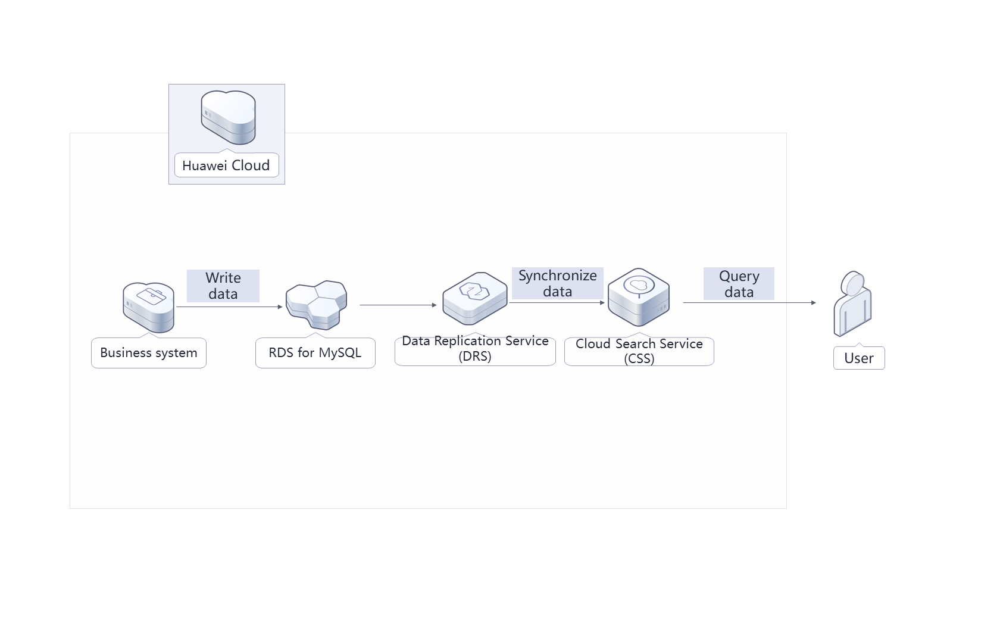

**Architecture Description**
---------------
This solution will:

- Create RDS databases to store your business data.
- Use DRS to synchronize RDS data to CSS in real time.
- Create a CSS cluster. CSS is a fully hosted, distributed search service powered by open-source Elasticsearch. It provides high-concurrency and low-latency query and analysis capabilities.

**File Structure**
---------------

``` lua
huaweicloud-solution-search-acceleration-based-CSS
├── search-acceleration-based-css-new-vpc.tf.json -- Resource orchestration template
```
**Getting Started**
---------------

**Synchronizing Data**

After the deployment is complete, the MySQL database and CSS cluster are automatically created. This section describes how to configure DRS to synchronize data.

1. Log in to the [DRS console](https://console-intl.huaweicloud.com/drs/?agencyId=WOmAijZnbElNjCFzTVDl4aJQAgdaTUMD&region=ap-southeast-3&locale=en-us#/drs/migrate/list), choose **Data Synchronization Management** from the navigation pane, and click **Create Synchronization Task**.

	Figure 1 DRS console
	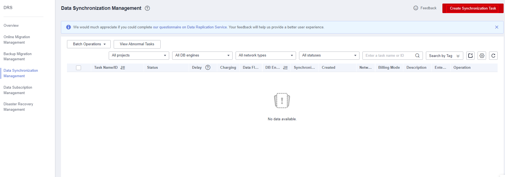

2. Configure the synchronization instance. Select **Out of the cloud** for **Data Flow**, **MySQL** for **Source DB Engine**, **CSS/ES** for **Destination DB Engine**, **VPC** for **Network Type**, select the corresponding MySQL instance name, and select the subnet where the instance to be synchronized resides. Click **Create Now**.

	Figure 2 Setting synchronization instance details
	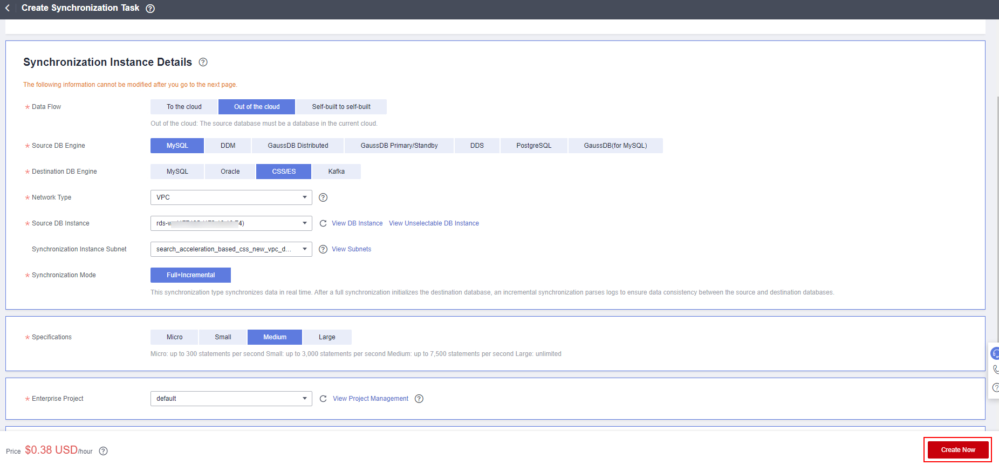

3. After the synchronization instance is created, configure the source and destination databases, enter the MySQL database username (**root**) and password (set during solution deployment), and click **Test Connection**. Enter the connection IP address of the CSS cluster automatically deployed in the solution, username (**admin**), and password (set during solution deployment), and click **Test Connection**. Click **Next**.

	Figure 3 Configuring the source and destination databases

	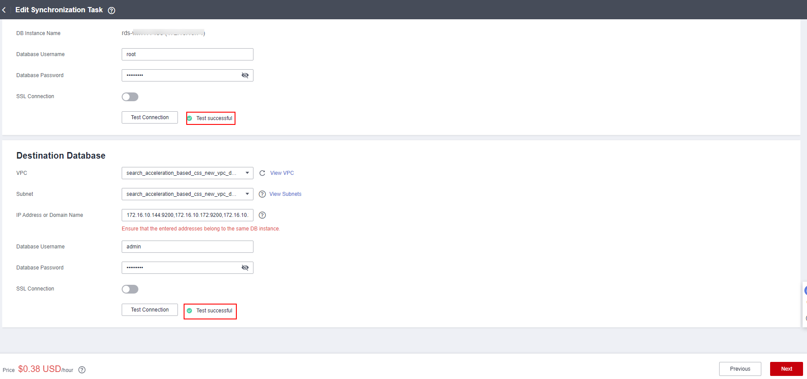

	Figure 4 Obtaining the connection IP address of the destination database

	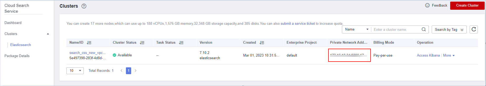

4. Select synchronization objects, click the right arrow, and click **Next**.

	Figure 5 Editing a synchronization task

	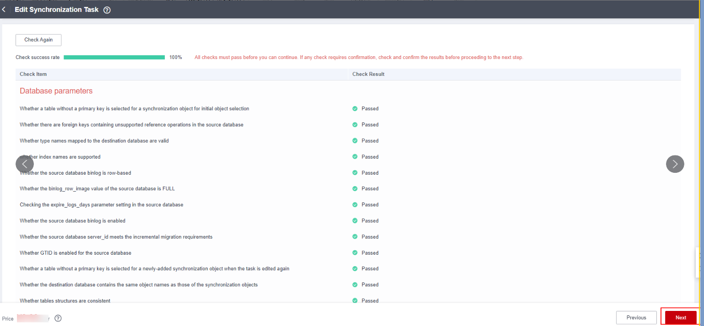

5. Select a data processing method as required. This solution does not require data processing. Click **Next**.

6. Perform a pre-check, wait until the pre-check is complete, and click **Next**.

	Figure 6 Performing a pre-check

	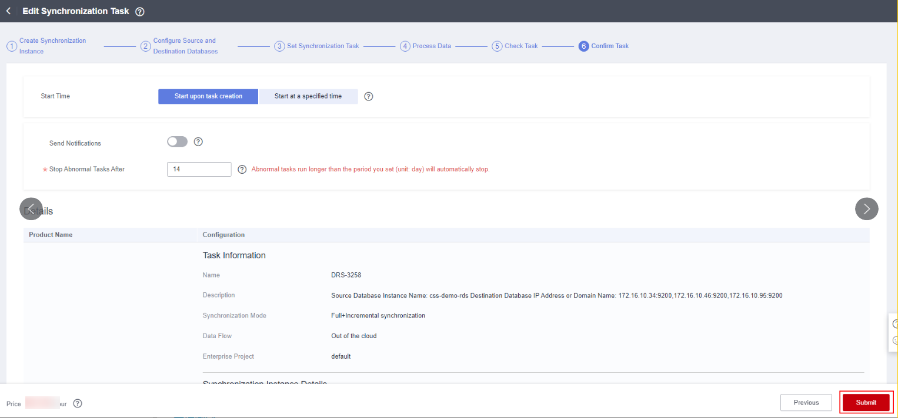

7. Select **Start upon task creation** for **Start Time** and click **Submit**. Wait until the full synchronization is completed and the incremental synchronization is started.

	Figure 7 Confirming a task

	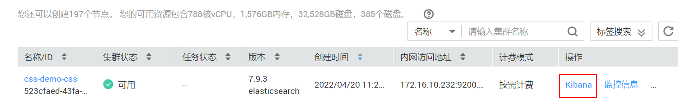

**Query Test**

This section describes how to use CSS to query data.

1. Log in to the [CSS console](https://console-intl.huaweicloud.com/elasticsearch/?agencyId=WOmAijZnbElNjCFzTVDl4aJQAgdaTUMD&region=ap-southeast-3&locale=en-us#/es/management/dashboard). On the cluster management page, click **Kibana** in the **Operation** column of the cluster created in this solution. The Kibana page is displayed.

	Figure 8 CSS cluster management page

	

2. Enter the username (**admin**) and password (set during solution deployment) to log in to Kibana.

	Figure 9 Logging in to Kibana

	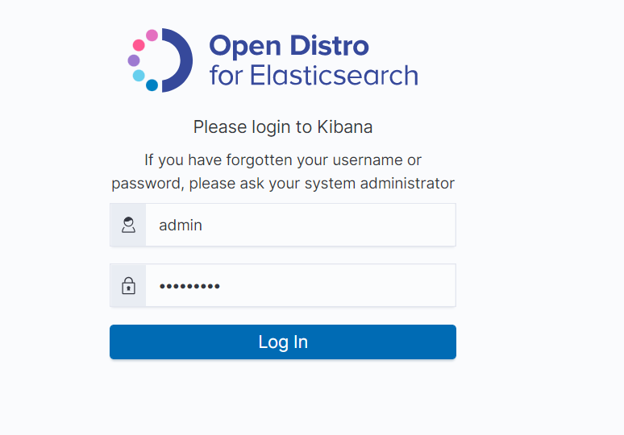

3. Click the icon in the upper left corner and choose **Dev Tools**.

	Figure 10 Dev Tools

	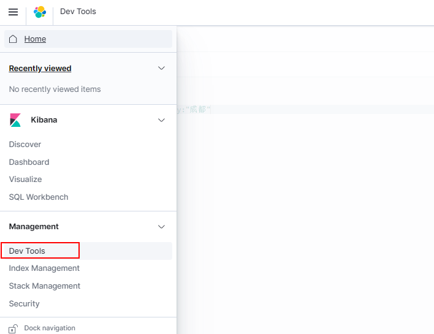

4. On the debugging page of Dev Tools, run a query statement for debugging.
For example: **GET t_user_store_info/_search?q=city:"Singapore"** #Query all Singapore merchants in the merchant table.

	Figure 11 Query result

	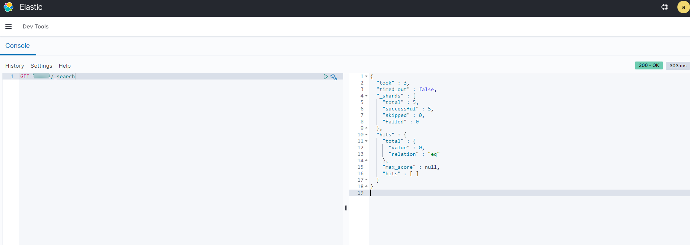

If the query result contains Singapore merchants, the query is successful.


